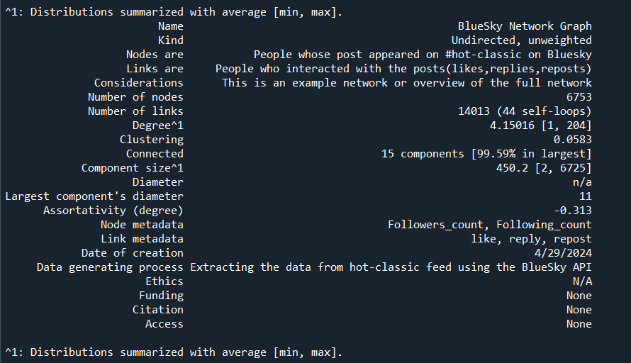

# Statistical-Network-Analysis
In this project, Bluesky, a social media application, is represented as a network which depicts the social interactions on the network.

Data Extraction:
- The file project_data.py contains the code to extract the data from Bluesky API.
- The file network.py is an example code to call the functions of different classes to extract data from the Bluesky API.
- Full_net_card displays the summary of the network. The card is available in latex format as `Bsky_network_card`.
  

The Network Description:

  
  
- The network described using a [network card](https://github.com/vgentela/Statistical-Network-Analysis/blob/main/Bsky_network_card.tex)
- Network card is a network descriptor which can be used by importing the network-cards library. More on network cards in the [paper](https://arxiv.org/abs/2206.00026) and the [GitHub repository](https://github.com/network-cards/network-cards)
  
The Network itself:
You can find the network file in the gml format: [Network](https://github.com/vgentela/Statistical-Network-Analysis/blob/main/n17.gml)

To be fixed:
- There are a couple of fucntions that need fixing, such as the worker and rec function that recursively extract data from feeds found in the current feed until you reach a termination condition.
License:
All the contents in this repository are licensed using [CC0 1.0 Universal LICENSE](https://github.com/vgentela/Statistical-Network-Analysis/blob/main/LICENSE)
